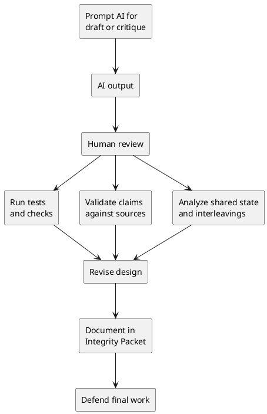

# AI as a Thinking Partner in Software Development


## Video: https://youtu.be/ci1Gn0JF8HE
## Metadata
- Course: CS 5891b - Object-Oriented Systems Under Concurrency
- Week: 1
- Lecture: AI as a Thinking Partner in Software Development
- Duration: 15 minutes
- Prerequisites: Basic software design, testing, version control, responsible AI disclosure
- Assignment Alignment: [A0 - Project Selection, Environment & Integrity Packet](../../../assignments/A0/index.md), [A1 - Object Model Under Concurrency](../../../assignments/A1/index.md), [AI Usage Log Template](../../../assignments/shared/ai-usage-log-template.md)


## Learning Objectives
- Analyze where AI can improve software design reasoning without replacing engineering judgment.
- Diagnose common AI failure modes in code, design, citations, and concurrency reasoning.
- Evaluate AI-generated claims against tests, logs, primary sources, and system constraints.
- Design a verification workflow for AI-assisted engineering work.
- Defend AI-assisted decisions using an Individual Integrity Packet.

## Opening Narrative
A student asks AI to improve a publish function for a podcast episode. The AI produces clean code, confident explanation, and a friendly warning about checking errors. The function passes a simple test. Under concurrent execution, however, two workers publish the same episode and both send notifications. The AI helped produce a plausible draft, but it did not prove correctness.

How should engineers use AI as a thinking partner while still owning the final design?

## Core Concepts

### AI as Draft, Not Evidence
- Definition: AI output is a proposed artifact that must be checked before use.
- Why it matters: A fluent answer can create false confidence.
- Mechanism: The model predicts plausible text or code from context; it does not execute the system or know hidden constraints unless provided.
- Failure mode: Students submit generated claims they cannot defend.
- Design implication: AI output should enter a verification workflow before becoming part of the system.

### Productive AI Use
- Definition: Using AI to expand options, explain unfamiliar material, draft tests, and challenge assumptions.
- Why it matters: AI can increase the range of ideas considered early in design.
- Mechanism: The student asks for alternatives, critiques, edge cases, and comparisons.
- Failure mode: AI becomes an answer machine rather than a reasoning partner.
- Design implication: Prompts should ask for risks, assumptions, and validation strategies, not just code.

### AI Failure Modes
- Definition: Recurring ways AI-generated output becomes incorrect, incomplete, or misleading.
- Why it matters: Failure modes are predictable enough to check deliberately.
- Mechanism: The model may hallucinate APIs, ignore local constraints, miss edge cases, assume sequential behavior, or invent citations.
- Failure mode: The code looks professional but violates the project invariant.
- Design implication: Students must identify what the AI did not know and what evidence is needed.

### The Concurrency Blind Spot
- Definition: AI often reasons as though operations happen one at a time unless concurrency is made explicit.
- Why it matters: This course focuses on systems that fail under overlapping execution.
- Mechanism: Generated code commonly checks state, mutates state, and emits side effects without atomicity or idempotency.
- Failure mode: Race conditions, lost updates, duplicate execution, inconsistent state transitions, and unsafe retries.
- Design implication: Every AI-assisted design must be reviewed for shared state and interleavings.

### Individual Integrity Packet
- Definition: A record of how the student used AI, evaluated it, corrected it, and took ownership.
- Why it matters: It distinguishes assisted learning from unverified outsourcing.
- Mechanism: The packet captures objective, prompts, output summary, critique, evidence, validation, ownership, and reflection.
- Failure mode: The student can show an AI transcript but cannot defend the final work.
- Design implication: AI use must be visible, reviewable, and connected to evidence.

## System / Architecture View



The AI-assisted workflow is not complete when the model answers. It is complete when the student can defend the revised artifact with evidence.

## Worked Example

### Problem Setup
The system includes an `Episode` that moves from draft to published. AI is asked to improve a publish function.

### Naive AI-Assisted Implementation

```python
def publish_episode(episode_id):
    episode = load_episode(episode_id)
    if episode.status == "draft":
        episode.status = "published"
        save_episode(episode)
        notify_subscribers(episode_id)
```

The code is readable and may pass a unit test. The hidden assumption is that no other worker changes the episode between `load_episode` and `save_episode`.

### Failure Scenario
Two workers call `publish_episode` for the same episode. Both read `draft`. Both save `published`. Both notify subscribers. The AI-generated code did not protect the transition or make notification idempotent.

### Corrected Design Direction
A safer design ties the side effect to one successful state transition:

```python
def publish_episode(episode_id, expected_version):
    changed = transition_status(
        episode_id,
        from_status="draft",
        to_status="published",
        expected_version=expected_version
    )
    if changed:
        notify_subscribers_once(episode_id)
```

This direction is safer because only the operation that wins the transition emits the side effect. The student still must verify that `transition_status` is atomic in the chosen storage mechanism.

### Integrity Packet Entry

```markdown
## AI Output Summary
AI suggested a simple check-then-save publish function.

## Critique
The response did not discuss concurrent workers, version checks, or duplicate notification.

## Evidence
Concurrent test with 5 workers produced duplicate notification events before redesign.

## Revision
Changed publish to use an atomic transition and idempotent notification.

## Validation
Re-ran concurrent test and verified one publish transition per episode.
```

## Visual Model Anchors

### System Interaction
Actors:
- Student engineer
- AI assistant
- Integrity Packet
- Course reviewer

Flow:
- Student asks for a design proposal for a podcast or order workflow
- AI proposes a mechanism and names its protected invariant
- Student validates the proposal with a failure-focused test before accepting it

Diagram intent:
- Show the normal interaction before AI as Draft, Not Evidence is placed under pressure.

### State Transition Model
States:
- PROMPTED
- PROPOSED
- CHALLENGED
- VALIDATED
- RECORDED

Transitions:
- PROMPTED -> PROPOSED: AI returns a design option
- PROPOSED -> CHALLENGED: student asks what failure the option prevents
- CHALLENGED -> VALIDATED: test evidence supports the claim
- VALIDATED -> RECORDED: decision and limits enter the Integrity Packet

Invariant:
- AI assistance cannot replace the student-owned design claim, evidence, and trade-off.

### Failure Interleaving
Interleaving:
T1: AI suggests adding a global lock to the order workflow
T2: Student accepts it before checking throughput, fairness, or deadlock risk

Failure:
- The student can name the tool but not the protected property or remaining risk.

Violated invariant:
- AI assistance cannot replace the student-owned design claim, evidence, and trade-off.

### Failure Scenario
Pressure:
- Oral review asks why the AI-generated mechanism is appropriate under concurrent workers.

Observed:
- The student can name the tool but not the protected property or remaining risk.

Root cause:
- The AI output was treated as authority instead of a hypothesis requiring validation.

Evidence:
- Prompt log, rejected alternatives, stress-test logs, and Integrity Packet decision notes.

### Design Response
Protected property:
- Design ownership stays with the student even when AI contributes options.

Mechanism:
- Require every AI suggestion to include invariant, failure case, validation command, and trade-off.

Trade-off:
- Slower prompting, but a stronger defense under challenge.

Diagram intent:
- Show the baseline path beside the corrected path and label the point where the invariant is protected.

### Evidence Flow
Claim:
- AI support is acceptable for [A0 - Project Selection, Environment & Integrity Packet](../../../assignments/A0/index.md), [A1 - Object Model Under Concurrency](../../../assignments/A1/index.md), [AI Usage Log Template](../../../assignments/shared/ai-usage-log-template.md) only when the student can defend the resulting design with evidence.

Evidence:
- Prompt log, rejected alternatives, stress-test logs, and Integrity Packet decision notes.

Review question:
- Which part of this design did the AI suggest, and how did you prove it was correct enough?

Decision:
- Keep AI-generated ideas only after they survive a concrete failure scenario.
## Failure Modes and Anti-Patterns

- Symptom: AI produces code that compiles but violates an invariant.
  - Why it happens: The prompt did not include state ownership, concurrency pressure, or failure constraints.
  - How to detect it: Test the invariant under normal and overlapping execution.
  - How to correct it: Revise the prompt and the design around explicit invariants.

- Symptom: AI invents APIs or citations.
  - Why it happens: Plausibility is not the same as source-grounded accuracy.
  - How to detect it: Check primary documentation or execute the code.
  - How to correct it: Replace unsupported claims with verified references or remove them.

- Symptom: AI explains the happy path but omits failure behavior.
  - Why it happens: The model optimizes for a coherent answer unless asked to stress the design.
  - How to detect it: Ask what breaks under retries, concurrency, partial failure, or stale reads.
  - How to correct it: Require failure modes and validation evidence.

- Symptom: The student cannot explain the final answer.
  - Why it happens: AI output was accepted before being internalized.
  - How to detect it: Oral questions reveal missing reasoning.
  - How to correct it: Rewrite the solution in the student's own structure and document the reasoning trail.

- Symptom: AI suggestions are logged but not critiqued.
  - Why it happens: Disclosure is treated as sufficient.
  - How to detect it: The packet lacks accepted/rejected/verified distinctions.
  - How to correct it: Add critique and validation sections to the AI usage record.

## Trade-Off Analysis

| Approach | Strengths | Weaknesses | When to Use |
|---|---|---|---|
| AI for brainstorming | Expands design options quickly | Can produce shallow or generic alternatives | Early design exploration |
| AI for code draft | Speeds initial implementation | May miss local constraints and concurrency risks | Small, reviewed units of code |
| AI for test ideas | Surfaces edge cases | Tests may not be executable or relevant | Before validation planning |
| AI for critique | Helps challenge assumptions | Can still miss domain-specific failures | After writing a baseline design |
| No AI use | Forces independent reasoning | May reduce exposure to alternative designs | When assessment requires unaided work |

## Practical Application

Tomorrow morning:

- Ask AI for two alternative object models for your selected domain.
- Ask AI to identify concurrency risks in each model.
- Mark which suggestions you accept, reject, and need to verify.
- Run or design at least one test that checks an AI-generated claim.
- Check any API or technical claim against primary documentation.
- Add the prompt summary, critique, revision, and validation evidence to your Integrity Packet.
- Prepare to explain one AI mistake without reading the transcript.

## Assignment Integration

This lecture supports [A0](../../../assignments/A0/index.md) through the AI Usage Plan and Integrity Packet. It also supports [A1](../../../assignments/A1/index.md), where students must ask AI to propose an object model or concurrency fix, then identify flaws, risks, or missing assumptions.

The student should demonstrate that AI was used to support reasoning, not replace it. Evidence of mastery includes a meaningful prompt, a clear critique of the AI response, verification against tests or sources, and an ownership statement in the packet.

## Validation and Interview Questions

1. What is the difference between AI output and engineering evidence?
2. Why is concurrency a common blind spot in AI-generated code?
3. What invariant would the naive `publish_episode` function violate?
4. How would you test whether an AI-suggested fix is actually safe?
5. What AI suggestion did you reject, and what evidence supported that rejection?
6. When is AI most useful as a thinking partner?
7. What belongs in the Individual Integrity Packet after AI-assisted work?
8. How would you defend AI-assisted code during an oral review?

## Summary

The central insight is that AI can accelerate engineering thought, but it cannot own correctness. In professional practice, generated code and explanations must be checked against system constraints, evidence, and failure modes. In this course, AI use is acceptable when it is visible, critiqued, validated, and owned by the student.

## Further Reading

- [AI Usage Log Template](../../../assignments/shared/ai-usage-log-template.md)
- [Integrity Packet Template](../../../assignments/shared/integrity-packet-template.md)
- Topic: AI-assisted software engineering verification
- Topic: Code review checklists for generated code
- Topic: Idempotency and atomic state transitions
- Search phrase: "AI generated code verification concurrency"
- Search phrase: "responsible AI use software engineering education"
