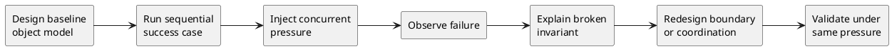

# Course Model: Design Under Pressure

## Video: https://youtu.be/OamJDTaJU8M
## Metadata
- Course: CS 5254b - Object-Oriented Systems Under Concurrency
- Week: 1
- Lecture: Course Model: Design Under Pressure
- Duration: 15 minutes
- Prerequisites: Basic object-oriented design, stateful objects, simple workflow modeling
- Assignment Alignment: [A1 - Object Model Under Concurrency](../../../assignments/A1/index.md)

## Learning Objectives
- Analyze why object-oriented systems that pass sequential tests can fail under concurrent execution.
- Evaluate the course cycle of design, break, understand, fix, and validate.
- Diagnose hidden assumptions in baseline object models.
- Defend why intentional failure is a legitimate engineering method.
- Justify how evidence changes a design claim into a defensible result.

## Opening Narrative
An engineering team builds a small podcast publishing service. The `Episode` object has a status field, the workflow passes every unit test, and the demo looks clean: draft, process assets, publish, notify subscribers. Then two workers retry the same publish command during a queue delay. Both observe the episode as ready. Both send the notification. The system did exactly what the code allowed, but not what the team believed.

This course starts from that gap: when does a clean object model become unsafe under pressure?

## Core Concepts

### The Happy Path Trap
- Definition: A design error where correctness is evaluated only under the intended sequential execution path.
- Why it matters: Many object models appear correct because only one actor is changing state during the test.
- Mechanism: The model hides assumptions about order, exclusivity, and atomicity.
- Failure mode: Two operations interleave and both believe they are valid.
- Design implication: Every state transition must be evaluated under overlapping execution, not just logical sequence.

### Concurrency Pressure
- Definition: The deliberate introduction of overlapping operations against shared state.
- Why it matters: Pressure exposes object boundaries that were too weak, too broad, or too optimistic.
- Mechanism: Multiple workers, users, retries, or requests observe and mutate the same state.
- Failure mode: Duplicate processing, lost updates, inconsistent status, or broken invariants.
- Design implication: Concurrency is not an implementation detail; it is a design condition.

### Iterative Resilience
- Definition: A course method: design a baseline, break it, explain the failure, redesign, and validate.
- Why it matters: Students must learn to defend design changes with evidence, not preference.
- Mechanism: Each assignment increases the amount of system pressure.
- Failure mode: A team fixes symptoms without understanding the failed invariant.
- Design implication: Redesign must be tied to the observed failure and re-tested under the same pressure.

### Evidence-Based Redesign
- Definition: A design revision justified by logs, tests, traces, or repeatable demonstrations.
- Why it matters: Graduate-level engineering requires defensible claims.
- Mechanism: A failure is captured, explained, corrected, and re-run.
- Failure mode: "It seems fixed" replaces validation.
- Design implication: Every correction needs a before/after comparison.

## System / Architecture View



The course repeatedly moves from model to evidence. The point is not to avoid failure early; the point is to make failure observable while the system is still small enough to reason about.

## Worked Example

### Problem Setup
The podcast domain uses an `Episode` object with status transitions:

```text
DRAFT -> ASSETS_READY -> READY_TO_PUBLISH -> PUBLISHED
```

A naive implementation treats this as a simple method call:

```python
def publish(episode):
    if episode.status == "READY_TO_PUBLISH":
        episode.status = "PUBLISHED"
        notify_subscribers(episode.id)
```

### Failure Scenario
Two workers call `publish` at the same time. Both read `READY_TO_PUBLISH`. Both set `PUBLISHED`. Both notify subscribers. The object model did not state who owns the transition or whether publishing is idempotent.

### Improved Design Direction
The improved design identifies the invariant: an episode may be published once, and notification must correspond to a single successful transition. A safer direction is to make the transition atomic, versioned, or owned by one publishing coordinator.

```python
def publish(episode_id, expected_version):
    updated = compare_and_set_status(
        episode_id,
        from_status="READY_TO_PUBLISH",
        to_status="PUBLISHED",
        expected_version=expected_version
    )
    if updated:
        notify_subscribers(episode_id)
```

This direction is safer because notification is tied to the transition that actually won. The design now has a concurrency-aware boundary.

## Visual Model Anchors

### System Interaction
Actors:
- Student developer
- Java stack
- Node.js stack
- Evidence directory

Flow:
- Run the same podcast workflow from a checked-in script
- Both stacks emit `operationId`, `entityId`, `action`, and `state` fields
- Reviewer compares command output and logs without using the student IDE

Diagram intent:
- Show the normal interaction before The Happy Path Trap is placed under pressure.

### State Transition Model
States:
- UNCONFIGURED
- RUNNABLE_LOCAL
- REPRODUCIBLE_REVIEW
- EVIDENCE_ACCEPTED

Transitions:
- UNCONFIGURED -> RUNNABLE_LOCAL: install runtime and run setup script
- RUNNABLE_LOCAL -> REPRODUCIBLE_REVIEW: peer runs the documented command
- REPRODUCIBLE_REVIEW -> EVIDENCE_ACCEPTED: logs match the shared schema

Invariant:
- The same domain workflow can be executed and compared in both stacks with traceable evidence.

### Failure Interleaving
Interleaving:
T1: Java stack logs `episode-42` with `operationId=op-17`
T2: Node.js stack logs the same transition without `operationId`

Failure:
- The reviewer cannot align Java and Node.js behavior for the same podcast episode.

Violated invariant:
- The same domain workflow can be executed and compared in both stacks with traceable evidence.

### Failure Scenario
Pressure:
- Peer review on a clean machine with no IDE state or local shell history.

Observed:
- The reviewer cannot align Java and Node.js behavior for the same podcast episode.

Root cause:
- The repository treated setup and logging as local convenience instead of evidence infrastructure.

Evidence:
- Version output, setup command transcript, stack-specific run logs, and a shared evidence index.

### Design Response
Protected property:
- Repository evidence remains reproducible across machines and across stacks.

Mechanism:
- Checked-in run scripts, pinned versions, shared log schema, and predictable evidence folders.

Trade-off:
- More setup discipline before feature work starts.

Diagram intent:
- Show the baseline path beside the corrected path and label the point where the invariant is protected.

### Evidence Flow
Claim:
- The project is ready for [A1 - Object Model Under Concurrency](../../../assignments/A1/index.md) because a reviewer can rerun and compare the baseline workflow.

Evidence:
- Version output, setup command transcript, stack-specific run logs, and a shared evidence index.

Review question:
- Can another student reproduce the same run without asking which IDE button was clicked?

Decision:
- Reject environment claims that lack command output or comparable logs.
## Failure Modes and Anti-Patterns

- Symptom: The system passes all sequential tests.
  - Why it happens: Tests execute the assumed order rather than overlapping operations.
  - How to detect it: Add repeated concurrent tests with operation IDs.
  - How to correct it: Identify shared state and test overlapping access.

- Symptom: Duplicate notifications or double shipments.
  - Why it happens: Side effects are not tied to a single successful state transition.
  - How to detect it: Count side effects per entity ID.
  - How to correct it: Use idempotency keys, atomic transitions, or a single owner.

- Symptom: Students add locks everywhere.
  - Why it happens: Synchronization is used before the failure is understood.
  - How to detect it: The explanation names a mechanism but not the invariant.
  - How to correct it: State the invariant first, then choose the coordination strategy.

- Symptom: The redesign cannot be compared to the baseline.
  - Why it happens: The failure was not captured reproducibly.
  - How to detect it: There is no before/after evidence.
  - How to correct it: Preserve the failing test and rerun it after redesign.

## Trade-Off Analysis

| Approach | Strengths | Weaknesses | When to Use |
|---|---|---|---|
| Sequential baseline | Simple, easy to explain, good for initial model capture | Hides concurrency assumptions | First pass in A1 |
| Coarse locking | Quick protection around shared state | Can reduce throughput and hide poor boundaries | Small critical sections with clear ownership |
| Atomic state transition | Ties correctness to the transition itself | Requires storage or version support | Status changes, reservations, publishing |
| Single owner/coordinator | Clarifies responsibility | Can become a bottleneck | Workflows with strong ordering rules |
| Idempotent operation | Handles retries safely | Requires careful key and side-effect design | Queues, retries, external calls |

## Practical Application

Tomorrow morning:

- Pick one object in your project domain that owns meaningful state.
- Write one invariant that must remain true under concurrent access.
- Create a sequential success case.
- Create a concurrent test with at least five overlapping operations.
- Record what breaks, even if the failure is intermittent.
- Explain whether the failure is caused by state ownership, ordering, or side effects.

## Assignment Integration

This lecture supports [A1 - Object Model Under Concurrency](../../../assignments/A1/index.md). In A1, students implement a baseline system in two stacks, demonstrate where it fails under concurrency, and redesign it for correctness.

The student should demonstrate that they can capture a lecture starter model, adapt it to a domain, expose a real failure, and defend a redesign. Evidence of mastery includes logs showing the baseline failure, an explanation of the broken invariant, and a validated before/after comparison.

## Validation and Interview Questions

1. Why can a correct sequential object model fail under concurrent execution?
2. What invariant does the podcast publishing example need to preserve?
3. How would you prove that duplicate notification is a design failure rather than a logging artifact?
4. When is a lock an appropriate design response, and when is it a distraction?
5. What evidence would convince you that a redesigned transition is safer?
6. How does the design-break-understand-fix-validate cycle change the role of failure?
7. What hidden assumption is most dangerous in your selected project domain?

## Summary

The central insight is that correctness must be tested under the conditions the system will actually face. A baseline object model is useful, but it is only the starting hypothesis. Professional engineers do not merely hope that a design survives pressure; they create pressure, observe failure, redesign deliberately, and validate the result.

## Further Reading

- Search phrase: "lost update problem optimistic concurrency control"
- Search phrase: "idempotency keys distributed systems"
- Search phrase: "race condition state transition examples"
- Topic: Compare-and-set and versioned writes
- Topic: Designing invariants for stateful systems
