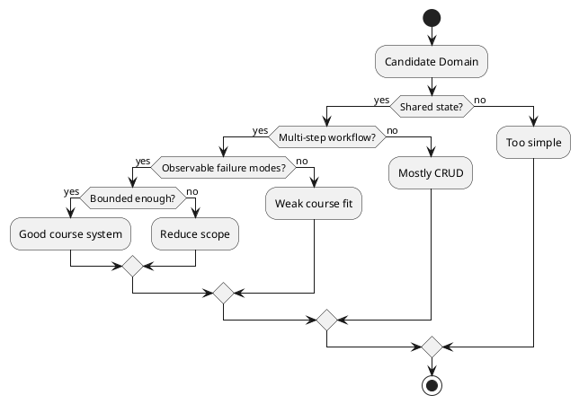

# What Makes a Good System for This Course

## Video: https://youtu.be/ovQMw-76VQU
## Metadata
- Course: CS 5254b - Object-Oriented Systems Under Concurrency
- Week: 1
- Lecture: What Makes a Good System for This Course
- Duration: 15 minutes
- Prerequisites: Basic domain modeling, object-oriented responsibilities, simple workflows
- Assignment Alignment: [A0 - Project Selection, Environment & Integrity Packet](../../../assignments/A0/index.md), [Project Domains](../../../projects/README.md)

## Learning Objectives
- Evaluate whether a project domain has enough concurrency pressure for the course.
- Compare domains by shared state, workflow depth, and failure potential.
- Design an initial object model that can evolve across A1-A4.
- Justify why a selected domain is neither too trivial nor too large.
- Defend domain suitability using concrete invariants and failure scenarios.

## Opening Narrative
A student proposes a simple note-taking app. It has classes, persistence, and a user interface, but the core workflow is mostly create, read, update, and delete. Another student proposes a full distributed database. That system has concurrency everywhere, but it is too large to reason about in a semester. Both choices miss the course target.

What kind of system is small enough to implement but rich enough to fail in meaningful ways?

## Core Concepts

### Shared Mutable State
- Definition: Data that multiple actors or operations can read and modify.
- Why it matters: Concurrency failures require some state that can be contested.
- Mechanism: Workers, users, queues, or retries interact with the same entity.
- Failure mode: Lost updates, duplicate processing, or inconsistent reads.
- Design implication: A good domain has state worth protecting.

### Multi-Step Workflow
- Definition: A process that moves through ordered stages rather than a single operation.
- Why it matters: Ordering creates invariants and coordination requirements.
- Mechanism: The system must ensure that later steps do not occur before prerequisites.
- Failure mode: Publishing before assets are ready, shipping before payment clears, or completing a job twice.
- Design implication: Choose a domain where state transitions have meaning.

### Natural Failure Potential
- Definition: The domain should plausibly break under concurrency, retries, partial failure, or scale.
- Why it matters: The assignments require observable failures and redesigns.
- Mechanism: Multiple actors compete for resources or advance workflow state.
- Failure mode: A trivial domain has nothing meaningful to break.
- Design implication: Select a domain with realistic pressure points.

### Bounded Complexity
- Definition: The system is complex enough for design tradeoffs but small enough for repeated implementation.
- Why it matters: Students must implement, break, fix, and explain the system in two stacks.
- Mechanism: A focused workflow provides depth without uncontrolled scope.
- Failure mode: Overly broad systems produce vague designs and shallow evidence.
- Design implication: Prefer one strong workflow over many weak features.

## System / Architecture View



The goal is not maximum complexity. The goal is a domain where correctness depends on object boundaries, state transitions, coordination, and evidence.

## Worked Example

### Problem Setup
Podcast production is a strong course domain. An episode depends on audio, transcript, artwork, review, and publication. Several workers may process assets, and a publish operation depends on all required assets being complete.

### Naive Mental Model
The naive model treats each task independently:

```python
episode.audio_ready = True
episode.transcript_ready = True
episode.art_ready = True
episode.status = "PUBLISHED"
```

### Failure Scenario
A publish worker checks readiness while an asset worker is still updating state. The episode appears ready because one field was written early, or publication is triggered twice by repeated events.

### Improved Design Direction
Define a central invariant: an episode cannot be published until all required assets are complete and the publish transition succeeds exactly once.

```text
Episode invariant:
PUBLISHED implies audio_ready && transcript_ready && art_ready && review_approved.
```

This design direction is safer because it identifies the state that must be protected and the transition that must be validated.

## Visual Model Anchors

### System Interaction
Actors:
- Student developer
- Java stack
- Node.js stack
- Evidence directory

Flow:
- Run the same podcast workflow from a checked-in script
- Both stacks emit `operationId`, `entityId`, `action`, and `state` fields
- Reviewer compares command output and logs without using the student IDE

Diagram intent:
- Show the normal interaction before Shared Mutable State is placed under pressure.

### State Transition Model
States:
- UNCONFIGURED
- RUNNABLE_LOCAL
- REPRODUCIBLE_REVIEW
- EVIDENCE_ACCEPTED

Transitions:
- UNCONFIGURED -> RUNNABLE_LOCAL: install runtime and run setup script
- RUNNABLE_LOCAL -> REPRODUCIBLE_REVIEW: peer runs the documented command
- REPRODUCIBLE_REVIEW -> EVIDENCE_ACCEPTED: logs match the shared schema

Invariant:
- The same domain workflow can be executed and compared in both stacks with traceable evidence.

### Failure Interleaving
Interleaving:
T1: Java stack logs `episode-42` with `operationId=op-17`
T2: Node.js stack logs the same transition without `operationId`

Failure:
- The reviewer cannot align Java and Node.js behavior for the same podcast episode.

Violated invariant:
- The same domain workflow can be executed and compared in both stacks with traceable evidence.

### Failure Scenario
Pressure:
- Peer review on a clean machine with no IDE state or local shell history.

Observed:
- The reviewer cannot align Java and Node.js behavior for the same podcast episode.

Root cause:
- The repository treated setup and logging as local convenience instead of evidence infrastructure.

Evidence:
- Version output, setup command transcript, stack-specific run logs, and a shared evidence index.

### Design Response
Protected property:
- Repository evidence remains reproducible across machines and across stacks.

Mechanism:
- Checked-in run scripts, pinned versions, shared log schema, and predictable evidence folders.

Trade-off:
- More setup discipline before feature work starts.

Diagram intent:
- Show the baseline path beside the corrected path and label the point where the invariant is protected.

### Evidence Flow
Claim:
- The project is ready for [A0 - Project Selection, Environment & Integrity Packet](../../../assignments/A0/index.md), [Project Domains](../../../projects/README.md) because a reviewer can rerun and compare the baseline workflow.

Evidence:
- Version output, setup command transcript, stack-specific run logs, and a shared evidence index.

Review question:
- Can another student reproduce the same run without asking which IDE button was clicked?

Decision:
- Reject environment claims that lack command output or comparable logs.
## Failure Modes and Anti-Patterns

- Symptom: The project is mostly CRUD.
  - Why it happens: The domain has objects but no meaningful workflow.
  - How to detect it: There are no contested transitions or invariants.
  - How to correct it: Add a workflow with shared state and ordering constraints.

- Symptom: The project is too ambitious.
  - Why it happens: The student chooses an industry-scale system instead of a course-scale workflow.
  - How to detect it: The design cannot be explained in three to five core objects.
  - How to correct it: Narrow the scope to one workflow backbone.

- Symptom: Failures are artificial.
  - Why it happens: The domain does not naturally involve concurrent actors.
  - How to detect it: The failure requires unrealistic test behavior.
  - How to correct it: Choose a domain with real competition for state or resources.

- Symptom: The domain cannot evolve across assignments.
  - Why it happens: The initial system has no room for coordination, async events, or stress.
  - How to detect it: A1 exhausts the domain.
  - How to correct it: Select a workflow that can grow from object model to coordination to asynchronous design.

## Trade-Off Analysis

| Approach | Strengths | Weaknesses | When to Use |
|---|---|---|---|
| Podcast production | Clear workflow, rich state transitions | Requires careful asset modeling | Strong default domain |
| Order fulfillment | Familiar invariants, obvious contention | Can drift into external payment complexity | Inventory and shipping examples |
| Distributed job processing | Natural worker concurrency | Can become queue-infrastructure heavy | Worker coordination focus |
| Reservation system | Strong resource allocation failure modes | Edge cases can multiply quickly | Capacity and booking examples |
| AI content pipeline | Relevant to AI-assisted engineering | Risk of focusing on model behavior instead of system correctness | Content workflow and review gates |

## Practical Application

Tomorrow morning:

- Choose one approved project domain from [Project Domains](../../../projects/README.md).
- Identify three to five core objects.
- Write one workflow backbone.
- Name the shared mutable state.
- Write two invariants.
- Describe one race condition and one partial failure.
- Confirm the domain can support A1 through A4 without restarting.

## Assignment Integration

This lecture supports [A0 - Project Selection, Environment & Integrity Packet](../../../assignments/A0/index.md). A0 asks students to choose a semester domain and justify why it has real concurrency pressure.

The student should demonstrate that the domain is appropriate, scoped, and technically defensible. Evidence of mastery includes a domain description, initial object model, identified shared state, likely concurrent operations, and expected failure modes.

## Validation and Interview Questions

1. What makes a domain suitable for this course rather than merely interesting?
2. Which object in your domain owns the most important shared state?
3. What invariant would break if two workers acted at the same time?
4. Why is a pure CRUD application usually a weak fit?
5. How can an overly large system harm the quality of evidence?
6. How will your domain evolve from A1 to A4?
7. What failure would convince you that your domain has real concurrency pressure?

## Summary

The central insight is that a good course system is not the biggest system; it is the system with the clearest pressure points. Professional engineering depends on selecting a problem where state, workflow, failure, and evidence can be reasoned about. The right domain makes the rest of the semester possible.

## Further Reading

- [Project Domains](../../../projects/README.md)
- [Project Selection Guide](../../../projects/supporting-files/project-selection-guide.md)
- Topic: Domain-driven design aggregates and invariants
- Search phrase: "workflow state machine design"
- Search phrase: "shared mutable state concurrency examples"
