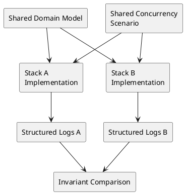

# Two-Stack Strategy

## Video: https://youtu.be/MikyU_TYp8E

## Metadata
- Course: CS 5891b - Object-Oriented Systems Under Concurrency
- Week: 1
- Lecture: Two-Stack Strategy
- Duration: 15 minutes
- Prerequisites: Basic programming in at least one language, runtime concepts, object-oriented design
- Assignment Alignment: [A0 - Project Selection, Environment & Integrity Packet](../../../assignments/A0/index.md), [A1 - Object Model Under Concurrency](../../../assignments/A1/index.md)

## Learning Objectives
- Compare how different runtimes expose or hide concurrency behavior.
- Design two implementations that preserve conceptual parity across stacks.
- Diagnose stack-specific behavior that changes the meaning of a test.
- Evaluate runtime tradeoffs for object models under concurrency.
- Defend stack choices using evidence rather than preference.

## Opening Narrative
A student implements the same reservation workflow in Java and Node.js. The Java version shows a race condition immediately when five threads reserve the last seat. The Node.js version appears safe until the code awaits a database call between reading capacity and writing the reservation. The design did not become correct; the runtime merely changed when the interleaving became visible.

How can two stacks be used as a comparison tool rather than a source of confusion?

## Core Concepts

### Runtime Variance
- Definition: Differences in how languages and platforms schedule work, isolate memory, and handle I/O.
- Why it matters: The same design can fail differently across runtimes.
- Mechanism: Threads, event loops, async/await, goroutines, locks, and memory models affect interleavings.
- Failure mode: Students mistake runtime behavior for design correctness.
- Design implication: Stack comparison must focus on the invariant, not surface syntax.

### Conceptual Parity
- Definition: The requirement that two implementations represent the same objects, states, workflows, and invariants.
- Why it matters: A two-stack comparison is meaningless if the systems are not equivalent.
- Mechanism: Shared domain diagrams, common test scenarios, and matched logging fields preserve comparison.
- Failure mode: One stack implements a different workflow and appears safer.
- Design implication: Parity must be documented before performance or style differences are interpreted.

### Hidden Assumptions
- Definition: Beliefs about execution order, atomicity, or isolation that are not stated in the design.
- Why it matters: Different stacks can hide or reveal different assumptions.
- Mechanism: A single-threaded event loop may hide a data race until I/O yields; a threaded runtime may expose it immediately.
- Failure mode: Students conclude that one language "solves" concurrency.
- Design implication: The test must create real overlap in both stacks.

### Comparable Evidence
- Definition: Logs, commands, and outputs that allow behavior to be compared across runtimes.
- Why it matters: A1 requires evidence that both implementations exercise the same design.
- Mechanism: Operation IDs, entity IDs, state transitions, and result codes should be logged in both stacks.
- Failure mode: The evidence proves each stack ran, but not that the same failure was tested.
- Design implication: Evidence format is part of the two-stack strategy.

## System / Architecture View



The two implementations should differ in runtime mechanics, not in the concept being tested.

## Worked Example

### Problem Setup
Use the podcast system in Java and Node.js. Both implement `Episode`, `AssetProcessor`, and `PublishingManager`. Both must enforce that an episode cannot publish until required assets are complete.

### Naive Mental Model
The student assumes that Node.js is safe because application code runs on a single event loop:

```javascript
async function publishEpisode(id) {
  const episode = await loadEpisode(id);
  if (episode.status === "READY_TO_PUBLISH") {
    await saveStatus(id, "PUBLISHED");
    await notifySubscribers(id);
  }
}
```

### Failure Scenario
Two requests load the same episode before either save completes. The `await` yields control, so both requests can continue from a stale read. Java may expose a similar issue through threads; Node.js exposes it through asynchronous I/O.

### Improved Design Direction
Both stacks should implement the same conceptual fix: tie publication to an atomic transition or single owner.

```text
publish(id):
  attempt READY_TO_PUBLISH -> PUBLISHED
  if transition succeeds:
    emit notification once
  else:
    report already-published or not-ready
```

This is safer because the comparison focuses on the invariant rather than the runtime's scheduling model.

## Visual Model Anchors

### System Interaction
Actors:
- Student developer
- Java stack
- Node.js stack
- Evidence directory

Flow:
- Run the same podcast workflow from a checked-in script
- Both stacks emit `operationId`, `entityId`, `action`, and `state` fields
- Reviewer compares command output and logs without using the student IDE

Diagram intent:
- Show the normal interaction before Runtime Variance is placed under pressure.

### State Transition Model
States:
- UNCONFIGURED
- RUNNABLE_LOCAL
- REPRODUCIBLE_REVIEW
- EVIDENCE_ACCEPTED

Transitions:
- UNCONFIGURED -> RUNNABLE_LOCAL: install runtime and run setup script
- RUNNABLE_LOCAL -> REPRODUCIBLE_REVIEW: peer runs the documented command
- REPRODUCIBLE_REVIEW -> EVIDENCE_ACCEPTED: logs match the shared schema

Invariant:
- The same domain workflow can be executed and compared in both stacks with traceable evidence.

### Failure Interleaving
Interleaving:
T1: Java stack logs `episode-42` with `operationId=op-17`
T2: Node.js stack logs the same transition without `operationId`

Failure:
- The reviewer cannot align Java and Node.js behavior for the same podcast episode.

Violated invariant:
- The same domain workflow can be executed and compared in both stacks with traceable evidence.

### Failure Scenario
Pressure:
- Peer review on a clean machine with no IDE state or local shell history.

Observed:
- The reviewer cannot align Java and Node.js behavior for the same podcast episode.

Root cause:
- The repository treated setup and logging as local convenience instead of evidence infrastructure.

Evidence:
- Version output, setup command transcript, stack-specific run logs, and a shared evidence index.

### Design Response
Protected property:
- Repository evidence remains reproducible across machines and across stacks.

Mechanism:
- Checked-in run scripts, pinned versions, shared log schema, and predictable evidence folders.

Trade-off:
- More setup discipline before feature work starts.

Diagram intent:
- Show the baseline path beside the corrected path and label the point where the invariant is protected.

### Evidence Flow
Claim:
- The project is ready for [A0 - Project Selection, Environment & Integrity Packet](../../../assignments/A0/index.md), [A1 - Object Model Under Concurrency](../../../assignments/A1/index.md) because a reviewer can rerun and compare the baseline workflow.

Evidence:
- Version output, setup command transcript, stack-specific run logs, and a shared evidence index.

Review question:
- Can another student reproduce the same run without asking which IDE button was clicked?

Decision:
- Reject environment claims that lack command output or comparable logs.
## Failure Modes and Anti-Patterns

- Symptom: One stack passes because the test is not actually concurrent.
  - Why it happens: The test uses sequential calls or no real overlap.
  - How to detect it: Logs show non-overlapping operation windows.
  - How to correct it: Add barriers, delays, repeated runs, or concurrent workers.

- Symptom: The two implementations drift.
  - Why it happens: Stack conventions reshape the domain model.
  - How to detect it: Object responsibilities or states differ.
  - How to correct it: Maintain a shared object model and parity checklist.

- Symptom: Runtime behavior is treated as design proof.
  - Why it happens: The student says "Node is single-threaded" or "Java has locks" without testing the invariant.
  - How to detect it: The explanation describes the platform but not the state transition.
  - How to correct it: Reframe the answer around the invariant and evidence.

- Symptom: Logs cannot be compared.
  - Why it happens: Each stack logs different fields.
  - How to detect it: There is no common operation ID or entity ID.
  - How to correct it: Define a shared structured log schema.

## Trade-Off Analysis

| Approach | Strengths | Weaknesses | When to Use |
|---|---|---|---|
| Java plus Node.js | Strong contrast between threads and event loop | Requires careful async reasoning | Good default comparison |
| Python plus Go | Contrasts interpreter constraints and lightweight concurrency | Python behavior can be misunderstood | Systems with worker-style tests |
| Java plus Go | Strong concurrency primitives in both | More implementation overhead | Students comfortable with compiled languages |
| Node.js plus Python | Accessible and fast to prototype | Can hide true parallelism without external I/O | Smaller workflows with async pressure |
| Same language twice | Easier parity | Weak runtime comparison | Not appropriate unless explicitly approved |

## Practical Application

Tomorrow morning:

- Choose two approved stacks from A0.
- Record runtime versions and package tools.
- Write a shared domain model independent of language syntax.
- Define common object names, states, and invariants.
- Create the same sequential test in both stacks.
- Define one shared concurrent test scenario.
- Standardize logs before writing failure analysis.

## Assignment Integration

This lecture supports [A0](../../../assignments/A0/index.md) stack selection and [A1](../../../assignments/A1/index.md) two-stack implementation. A1 requires the baseline object model to functionally match across both stacks and then fail under comparable concurrency pressure.

The student should demonstrate that the two systems are conceptually equivalent and that differences in observed behavior are explained through runtime mechanics. Evidence of mastery includes a parity table, shared tests, comparable logs, and a design-level explanation of failures.

## Validation and Interview Questions

1. What does conceptual parity mean in a two-stack assignment?
2. How can Node.js still exhibit concurrency bugs?
3. Why does Java often expose shared-memory races quickly?
4. What evidence proves that both stacks tested the same invariant?
5. How would you detect implementation drift between stacks?
6. When should runtime differences influence the redesign?
7. Why is "the language prevents it" usually an insufficient answer?

## Summary

The central insight is that two stacks are not busywork; they are a lens for discovering hidden assumptions. Professional engineers often compare behavior across runtimes, services, or deployments. The discipline is to preserve the design concept while observing how different execution models stress it.

## Further Reading

- [A1 - Object Model Under Concurrency](../../../assignments/A1/index.md)
- Topic: Java memory model and synchronization
- Topic: JavaScript event loop and async/await
- Topic: Go goroutines and channels
- Search phrase: "event loop race condition async await"
- Search phrase: "structured concurrency runtime comparison"
