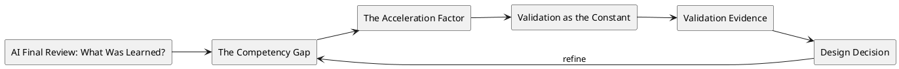

# AI Final Review: What Was Learned?

## Metadata
- Course: CS 5254b - Object-Oriented Systems Under Concurrency
- Week: 14
- Lecture: AI Final Review: What Was Learned?
- Duration: 15 minutes
- Prerequisites: Prior lectures on object state, concurrency pressure, structured evidence, and Integrity Packet reasoning
- Assignment Alignment: [A1](../../../assignments/A1/index.md)

## Learning Objectives
- Analyze the design pressure represented by ai final review: what was learned? in a stateful concurrent system.
- Diagnose the hidden assumptions that allow the system to appear correct before pressure is introduced.
- Evaluate failure evidence using logs, traces, interleavings, or repeatable test output.
- Design a correction or control that preserves the relevant invariant without obscuring trade-offs.
- Defend the chosen approach in the Integrity Packet and connect it to A1 deliverables.


## Opening Narrative
A student asks AI for a coordination design and receives confident code with a missing ordering guard. The answer is useful as a draft, but unsafe as evidence. Under concurrent execution the workflow stalls or violates an invariant. How should engineers use AI-generated designs without surrendering responsibility for correctness?

## Core Concepts
### The Competency Gap
- Definition: Identifying the specific areas where you (the human) consistently caught issues that the AI missed (e.g., deep race conditions).
- Why it matters: This concept identifies a condition that must be made explicit before the system can be trusted under pressure.
- Mechanism: It appears through object state, workflow timing, worker behavior, retries, queues, or coordination boundaries.
- Failure mode: If ignored, the system can pass the happy path while producing duplicate work, stale state, blocked progress, or misleading evidence.
- Design implication: The implementation should expose the relevant invariant, log the critical transition, and validate behavior with a repeatable test.

### The Acceleration Factor
- Definition: Quantifying where AI actually helped (e.g., generating boilerplate, suggesting standard patterns).
- Why it matters: This concept identifies a condition that must be made explicit before the system can be trusted under pressure.
- Mechanism: It appears through object state, workflow timing, worker behavior, retries, queues, or coordination boundaries.
- Failure mode: If ignored, the system can pass the happy path while producing duplicate work, stale state, blocked progress, or misleading evidence.
- Design implication: The implementation should expose the relevant invariant, log the critical transition, and validate behavior with a repeatable test.

### Validation as the Constant
- Definition: The reali
- Why it matters: This concept identifies a condition that must be made explicit before the system can be trusted under pressure.
- Mechanism: It appears through object state, workflow timing, worker behavior, retries, queues, or coordination boundaries.
- Failure mode: If ignored, the system can pass the happy path while producing duplicate work, stale state, blocked progress, or misleading evidence.
- Design implication: The implementation should expose the relevant invariant, log the critical transition, and validate behavior with a repeatable test.

### AI-Assisted Hypothesis
- Definition: A generated design or explanation that must be validated before adoption.
- Why it matters: This concept identifies a condition that must be made explicit before the system can be trusted under pressure.
- Mechanism: It appears through object state, workflow timing, worker behavior, retries, queues, or coordination boundaries.
- Failure mode: If ignored, the system can pass the happy path while producing duplicate work, stale state, blocked progress, or misleading evidence.
- Design implication: The implementation should expose the relevant invariant, log the critical transition, and validate behavior with a repeatable test.

### Human Verification
- Definition: The engineer-led process of checking AI output against code, tests, and evidence.
- Why it matters: This concept identifies a condition that must be made explicit before the system can be trusted under pressure.
- Mechanism: It appears through object state, workflow timing, worker behavior, retries, queues, or coordination boundaries.
- Failure mode: If ignored, the system can pass the happy path while producing duplicate work, stale state, blocked progress, or misleading evidence.
- Design implication: The implementation should expose the relevant invariant, log the critical transition, and validate behavior with a repeatable test.

## System / Architecture View


This view treats the lecture topic as a design pressure that must be connected to evidence. The system-level question is not whether the code can run once, but whether the relevant invariant still holds when timing, load, retries, or coordination complexity changes.

## Worked Example
### Problem Setup
The original lecture frames this topic with examples such as:

- **Reflection**: In A1, the AI suggested a fix that you blindly accepted and then watched fail. In A4, you used the AI to critique your "Recovery Design" and you found two hallucinations in its response before even writing code.
- **Verification**: Documenting that you rejected an AI's suggestion for a "Distributed Saga" because it was overkill for your local stress test.

### Naive Implementation or Mental Model
A naive design assumes that the operation happens once, in order, and with current state. That assumption is often invisible in code because the method name sounds correct and the sequential test passes.

```text
actor performs operation
system reads current state
system applies transition
system emits side effect
```

### Failure Scenario
Under overlapping execution, delayed delivery, retry, or partial failure, the same operation can observe stale state, execute twice, arrive late, or leave the workflow stuck. The failure is not merely a bug in syntax; it is a mismatch between the design assumption and the execution model.

### Corrected or Improved Design Direction
A safer direction is to name the invariant, make the transition observable, and add a correctness control appropriate to the failure: version checks, idempotency keys, state-machine guards, explicit coordination, retries with backoff, compensation, or reconciliation.

### Why the Improved Design Is Safer
The improved design is safer because it changes the problem from hoping the workflow executes in the intended order to proving that invalid interleavings are rejected, contained, or recovered with evidence.

## Visual Model Anchors

### System Interaction
Actors:
- Load driver
- API gateway
- Worker pool
- Database
- Metrics and log store

Flow:
- Load driver sends concurrent podcast or order workflow requests
- API gateway assigns correlation IDs and forwards work
- Worker pool processes state transitions while metrics and logs capture latency, errors, and retries

Diagram intent:
- Show the normal interaction before The Competency Gap is placed under pressure.

### State Transition Model
States:
- HEALTHY
- SATURATED
- DEGRADED
- RECOVERING
- STABLE

Transitions:
- HEALTHY -> SATURATED: request rate exceeds worker capacity
- SATURATED -> DEGRADED: queue depth and p95 latency cross threshold
- DEGRADED -> RECOVERING: load is reduced or backpressure starts
- RECOVERING -> STABLE: error rate and queue depth return to baseline

Invariant:
- The system either completes accepted work or exposes bounded degradation with enough evidence to recover.

### Failure Interleaving
Interleaving:
T1: Load test pushes 200 concurrent publish requests
T2: Worker pool retries slow database writes while the queue keeps accepting new work

Failure:
- Latency spikes, duplicate work, missing completion logs, or unbounded queue growth.

Violated invariant:
- The system either completes accepted work or exposes bounded degradation with enough evidence to recover.

### Failure Scenario
Pressure:
- Sustained load, partial database slowdown, and retry storms during recovery.

Observed:
- Latency spikes, duplicate work, missing completion logs, or unbounded queue growth.

Root cause:
- The baseline design assumed normal load and treated failure evidence as optional.

Evidence:
- Load profile, p50/p95/p99 latency, queue depth, retry counts, error logs, and recovery timeline.

### Design Response
Protected property:
- System integrity remains explainable when capacity, timing, or dependencies fail.

Mechanism:
- Backpressure, bounded retries, circuit breakers, compensation, reconciliation, and evidence dashboards.

Trade-off:
- Reduced peak throughput or delayed work in exchange for controlled recovery.

Diagram intent:
- Show the baseline path beside the corrected path and label the point where the invariant is protected.

### Evidence Flow
Claim:
- AI Final Review: What Was Learned? is defensible when the design shows both the failure and the recovery path with measurements.

Evidence:
- Load profile, p50/p95/p99 latency, queue depth, retry counts, error logs, and recovery timeline.

Review question:
- Which metric tells you the system is degraded but still controlled?

Decision:
- Accept a design only when its stress evidence includes baseline, failure, correction, and residual risk.
## Failure Modes and Anti-Patterns

- Symptom: The system passes a single happy-path demonstration.
  - Why it happens: The test avoids the timing, ordering, or pressure condition that exposes the design weakness.
  - How to detect it: Add repeated runs, concurrent actors, delayed events, structured logs, or stress conditions.
  - How to correct it: Preserve the happy-path test but add a failure-focused test that targets the invariant.

- Symptom: The explanation names a tool but not a design property.
  - Why it happens: Students focus on locks, queues, retries, or frameworks before stating what must remain true.
  - How to detect it: Ask which invariant the mechanism protects.
  - How to correct it: Write the invariant first, then select the mechanism.

- Symptom: Evidence is too vague to support the claim.
  - Why it happens: Logs lack operation IDs, entity IDs, state transitions, or timing information.
  - How to detect it: A reviewer cannot reconstruct the failure from the submitted artifact.
  - How to correct it: Capture structured evidence and link it directly to the design claim.

- Symptom: The fix changes behavior but is not compared to the baseline.
  - Why it happens: The failure was not preserved as a repeatable scenario.
  - How to detect it: There is no before/after run using the same workload.
  - How to correct it: Keep the failing test and rerun it after the redesign.

## Trade-Off Analysis

| Approach | Strengths | Weaknesses | When to Use |
|---|---|---|---|
| Simple baseline | Easy to explain and implement | Often hides timing and pressure assumptions | First implementation and comparison point |
| Guarded state transition | Protects the core invariant directly | Requires careful state modeling | Status changes, reservations, publishing, workflow steps |
| Explicit coordination | Makes dependencies visible | Can introduce waiting, deadlock, or bottlenecks | Multi-object workflows with ordering requirements |
| Idempotent or retry-safe design | Handles duplicate work and partial failure | Requires keys, deduplication, or side-effect control | Queues, retries, external calls, async workers |
| Observability-first design | Produces strong evidence for review | Adds instrumentation work | Assignments requiring failure proof and design defense |

## Practical Application

Tomorrow morning:

- Identify the invariant or progress property most relevant to ai final review: what was learned?.
- Write one sequential scenario that should succeed.
- Write one pressure scenario that could expose the failure.
- Add operation IDs and entity IDs to the logs before running the pressure scenario.
- Capture before/after evidence if you apply a fix.
- Update the Integrity Packet with the assumption, evidence, validation, and remaining risk.

## Assignment Integration
This lecture supports [A1](../../../assignments/A1/index.md). The student should connect the lecture concept to their semester project by showing the relevant object, workflow, event, failure, or recovery mechanism in their own domain.

Mastery should be demonstrated with concrete evidence: runnable commands, structured logs, before/after behavior, diagrams, failure reproduction, and an Integrity Packet explanation that defends the design choice.

## Validation and Interview Questions

1. What invariant or progress property is most relevant to this lecture?
2. What hidden assumption would make the baseline design appear correct?
3. How would you force the failure in a repeatable test?
4. What evidence would prove the failure occurred?
5. Which design mechanism would you choose first, and what trade-off does it introduce?
6. How would the same issue appear differently in your two implementation stacks?
7. What would you record in the Integrity Packet to defend your conclusion?

## Summary

The central insight is that ai final review: what was learned? is not just a vocabulary item; it is a way to reason about whether a system remains correct under realistic execution. The professional engineering task is to connect the concept to invariants, observable behavior, and defensible trade-offs. A design is not mature until it can be explained, stressed, repaired, and validated with evidence.

## Further Reading
- Search phrase: "AI Final Review: What Was Learned? distributed systems failure mode"
- Search phrase: "AI Final Review: What Was Learned? concurrency design tradeoffs"
- Topic: structured logging and correlation IDs
- Topic: invariants in stateful object-oriented systems
