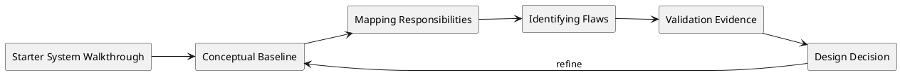

# Starter System Walkthrough

## Metadata
- Course: CS 5254b - Object-Oriented Systems Under Concurrency
- Week: 2
- Lecture: Starter System Walkthrough
- Duration: 15 minutes
- Prerequisites: Prior lectures on object state, concurrency pressure, structured evidence, and Integrity Packet reasoning
- Assignment Alignment: [A1](../../../assignments/A1/index.md)

## Learning Objectives
- Analyze the design pressure represented by starter system walkthrough in a stateful concurrent system.
- Diagnose the hidden assumptions that allow the system to appear correct before pressure is introduced.
- Evaluate failure evidence using logs, traces, interleavings, or repeatable test output.
- Design a correction or control that preserves the relevant invariant without obscuring trade-offs.
- Defend the chosen approach in the Integrity Packet and connect it to A1 deliverables.


## Opening Narrative
A course project appears correct during a simple demonstration. Once concurrency, ambiguity, or operational pressure is introduced, the design exposes a hidden assumption about Conceptual Baseline. What must the engineer analyze and defend before trusting the result?

## Core Concepts
### Conceptual Baseline
- Definition: Using a simple system (e.g., a basic Task Tracker) to illustrate design patterns.
- Why it matters: This concept identifies a condition that must be made explicit before the system can be trusted under pressure.
- Mechanism: It appears through object state, workflow timing, worker behavior, retries, queues, or coordination boundaries.
- Failure mode: If ignored, the system can pass the happy path while producing duplicate work, stale state, blocked progress, or misleading evidence.
- Design implication: The implementation should expose the relevant invariant, log the critical transition, and validate behavior with a repeatable test.

### Mapping Responsibilities
- Definition: Seeing how a "Task" object and a "Worker" object interact.
- Why it matters: This concept identifies a condition that must be made explicit before the system can be trusted under pressure.
- Mechanism: It appears through object state, workflow timing, worker behavior, retries, queues, or coordination boundaries.
- Failure mode: If ignored, the system can pass the happy path while producing duplicate work, stale state, blocked progress, or misleading evidence.
- Design implication: The implementation should expose the relevant invariant, log the critical transition, and validate behavior with a repeatable test.

### Identifying Flaws
- Definition: Recogni
- Why it matters: This concept identifies a condition that must be made explicit before the system can be trusted under pressure.
- Mechanism: It appears through object state, workflow timing, worker behavior, retries, queues, or coordination boundaries.
- Failure mode: If ignored, the system can pass the happy path while producing duplicate work, stale state, blocked progress, or misleading evidence.
- Design implication: The implementation should expose the relevant invariant, log the critical transition, and validate behavior with a repeatable test.

### System Invariant
- Definition: A condition that must remain true across all valid executions.
- Why it matters: This concept identifies a condition that must be made explicit before the system can be trusted under pressure.
- Mechanism: It appears through object state, workflow timing, worker behavior, retries, queues, or coordination boundaries.
- Failure mode: If ignored, the system can pass the happy path while producing duplicate work, stale state, blocked progress, or misleading evidence.
- Design implication: The implementation should expose the relevant invariant, log the critical transition, and validate behavior with a repeatable test.

### Failure Mode
- Definition: A repeatable way the system violates an invariant or loses progress.
- Why it matters: This concept identifies a condition that must be made explicit before the system can be trusted under pressure.
- Mechanism: It appears through object state, workflow timing, worker behavior, retries, queues, or coordination boundaries.
- Failure mode: If ignored, the system can pass the happy path while producing duplicate work, stale state, blocked progress, or misleading evidence.
- Design implication: The implementation should expose the relevant invariant, log the critical transition, and validate behavior with a repeatable test.

## System / Architecture View


This view treats the lecture topic as a design pressure that must be connected to evidence. The system-level question is not whether the code can run once, but whether the relevant invariant still holds when timing, load, retries, or coordination complexity changes.

## Worked Example
### Problem Setup
The original lecture frames this topic with examples such as:

- **Lecture System**: A simple Job Queue where multiple workers pull jobs. 
- **Intended Flaw**: The "pull" logic isn't atomic, allowing two workers to claim the same job.

### Naive Implementation or Mental Model
A naive design assumes that the operation happens once, in order, and with current state. That assumption is often invisible in code because the method name sounds correct and the sequential test passes.

```text
actor performs operation
system reads current state
system applies transition
system emits side effect
```

### Failure Scenario
Under overlapping execution, delayed delivery, retry, or partial failure, the same operation can observe stale state, execute twice, arrive late, or leave the workflow stuck. The failure is not merely a bug in syntax; it is a mismatch between the design assumption and the execution model.

### Corrected or Improved Design Direction
A safer direction is to name the invariant, make the transition observable, and add a correctness control appropriate to the failure: version checks, idempotency keys, state-machine guards, explicit coordination, retries with backoff, compensation, or reconciliation.

### Why the Improved Design Is Safer
The improved design is safer because it changes the problem from hoping the workflow executes in the intended order to proving that invalid interleavings are rejected, contained, or recovered with evidence.

## Visual Model Anchors

### System Interaction
Actors:
- Student developer
- Java stack
- Node.js stack
- Evidence directory

Flow:
- Run the same podcast workflow from a checked-in script
- Both stacks emit `operationId`, `entityId`, `action`, and `state` fields
- Reviewer compares command output and logs without using the student IDE

Diagram intent:
- Show the normal interaction before Conceptual Baseline is placed under pressure.

### State Transition Model
States:
- UNCONFIGURED
- RUNNABLE_LOCAL
- REPRODUCIBLE_REVIEW
- EVIDENCE_ACCEPTED

Transitions:
- UNCONFIGURED -> RUNNABLE_LOCAL: install runtime and run setup script
- RUNNABLE_LOCAL -> REPRODUCIBLE_REVIEW: peer runs the documented command
- REPRODUCIBLE_REVIEW -> EVIDENCE_ACCEPTED: logs match the shared schema

Invariant:
- The same domain workflow can be executed and compared in both stacks with traceable evidence.

### Failure Interleaving
Interleaving:
T1: Java stack logs `episode-42` with `operationId=op-17`
T2: Node.js stack logs the same transition without `operationId`

Failure:
- The reviewer cannot align Java and Node.js behavior for the same podcast episode.

Violated invariant:
- The same domain workflow can be executed and compared in both stacks with traceable evidence.

### Failure Scenario
Pressure:
- Peer review on a clean machine with no IDE state or local shell history.

Observed:
- The reviewer cannot align Java and Node.js behavior for the same podcast episode.

Root cause:
- The repository treated setup and logging as local convenience instead of evidence infrastructure.

Evidence:
- Version output, setup command transcript, stack-specific run logs, and a shared evidence index.

### Design Response
Protected property:
- Repository evidence remains reproducible across machines and across stacks.

Mechanism:
- Checked-in run scripts, pinned versions, shared log schema, and predictable evidence folders.

Trade-off:
- More setup discipline before feature work starts.

Diagram intent:
- Show the baseline path beside the corrected path and label the point where the invariant is protected.

### Evidence Flow
Claim:
- The project is ready for [A1](../../../assignments/A1/index.md) because a reviewer can rerun and compare the baseline workflow.

Evidence:
- Version output, setup command transcript, stack-specific run logs, and a shared evidence index.

Review question:
- Can another student reproduce the same run without asking which IDE button was clicked?

Decision:
- Reject environment claims that lack command output or comparable logs.
## Failure Modes and Anti-Patterns

- Symptom: The system passes a single happy-path demonstration.
  - Why it happens: The test avoids the timing, ordering, or pressure condition that exposes the design weakness.
  - How to detect it: Add repeated runs, concurrent actors, delayed events, structured logs, or stress conditions.
  - How to correct it: Preserve the happy-path test but add a failure-focused test that targets the invariant.

- Symptom: The explanation names a tool but not a design property.
  - Why it happens: Students focus on locks, queues, retries, or frameworks before stating what must remain true.
  - How to detect it: Ask which invariant the mechanism protects.
  - How to correct it: Write the invariant first, then select the mechanism.

- Symptom: Evidence is too vague to support the claim.
  - Why it happens: Logs lack operation IDs, entity IDs, state transitions, or timing information.
  - How to detect it: A reviewer cannot reconstruct the failure from the submitted artifact.
  - How to correct it: Capture structured evidence and link it directly to the design claim.

- Symptom: The fix changes behavior but is not compared to the baseline.
  - Why it happens: The failure was not preserved as a repeatable scenario.
  - How to detect it: There is no before/after run using the same workload.
  - How to correct it: Keep the failing test and rerun it after the redesign.

## Trade-Off Analysis

| Approach | Strengths | Weaknesses | When to Use |
|---|---|---|---|
| Simple baseline | Easy to explain and implement | Often hides timing and pressure assumptions | First implementation and comparison point |
| Guarded state transition | Protects the core invariant directly | Requires careful state modeling | Status changes, reservations, publishing, workflow steps |
| Explicit coordination | Makes dependencies visible | Can introduce waiting, deadlock, or bottlenecks | Multi-object workflows with ordering requirements |
| Idempotent or retry-safe design | Handles duplicate work and partial failure | Requires keys, deduplication, or side-effect control | Queues, retries, external calls, async workers |
| Observability-first design | Produces strong evidence for review | Adds instrumentation work | Assignments requiring failure proof and design defense |

## Practical Application

Tomorrow morning:

- Identify the invariant or progress property most relevant to starter system walkthrough.
- Write one sequential scenario that should succeed.
- Write one pressure scenario that could expose the failure.
- Add operation IDs and entity IDs to the logs before running the pressure scenario.
- Capture before/after evidence if you apply a fix.
- Update the Integrity Packet with the assumption, evidence, validation, and remaining risk.

## Assignment Integration
This lecture supports [A1](../../../assignments/A1/index.md). The student should connect the lecture concept to their semester project by showing the relevant object, workflow, event, failure, or recovery mechanism in their own domain.

Mastery should be demonstrated with concrete evidence: runnable commands, structured logs, before/after behavior, diagrams, failure reproduction, and an Integrity Packet explanation that defends the design choice.

## Validation and Interview Questions

1. What invariant or progress property is most relevant to this lecture?
2. What hidden assumption would make the baseline design appear correct?
3. How would you force the failure in a repeatable test?
4. What evidence would prove the failure occurred?
5. Which design mechanism would you choose first, and what trade-off does it introduce?
6. How would the same issue appear differently in your two implementation stacks?
7. What would you record in the Integrity Packet to defend your conclusion?

## Summary

The central insight is that starter system walkthrough is not just a vocabulary item; it is a way to reason about whether a system remains correct under realistic execution. The professional engineering task is to connect the concept to invariants, observable behavior, and defensible trade-offs. A design is not mature until it can be explained, stressed, repaired, and validated with evidence.

## Further Reading
- Search phrase: "Starter System Walkthrough distributed systems failure mode"
- Search phrase: "Starter System Walkthrough concurrency design tradeoffs"
- Topic: structured logging and correlation IDs
- Topic: invariants in stateful object-oriented systems
