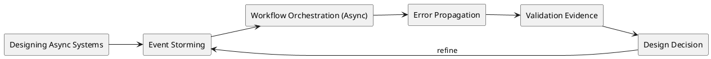

# Designing Async Systems


## Video: https://youtu.be/a3wnYs_BR7g
## Metadata
- Course: CS 5254b - Object-Oriented Systems Under Concurrency
- Week: 9
- Lecture: Designing Async Systems
- Duration: 15 minutes
- Prerequisites: Prior lectures on object state, concurrency pressure, structured evidence, and Integrity Packet reasoning
- Assignment Alignment: [A2](../../../assignments/A2/index.md)

## Learning Objectives
- Analyze the design pressure represented by designing async systems in a stateful concurrent system.
- Diagnose the hidden assumptions that allow the system to appear correct before pressure is introduced.
- Evaluate failure evidence using logs, traces, interleavings, or repeatable test output.
- Design a correction or control that preserves the relevant invariant without obscuring trade-offs.
- Defend the chosen approach in the Integrity Packet and connect it to A2 deliverables.


## Opening Narrative
A synchronous workflow is moved into background workers to improve responsiveness. The user no longer waits, but correctness now depends on events, retries, ordering, and observability. The design has changed even if the business workflow sounds the same. What must be made explicit when work moves across time?

## Core Concepts
### Event Storming
- Definition: Identifying all the significant events in a domain.
- Why it matters: This concept identifies a condition that must be made explicit before the system can be trusted under pressure.
- Mechanism: It appears through object state, workflow timing, worker behavior, retries, queues, or coordination boundaries.
- Failure mode: If ignored, the system can pass the happy path while producing duplicate work, stale state, blocked progress, or misleading evidence.
- Design implication: The implementation should expose the relevant invariant, log the critical transition, and validate behavior with a repeatable test.

### Workflow Orchestration (Async)
- Definition: Using an "Orchestrator Worker" to manage complex async logic.
- Why it matters: This concept identifies a condition that must be made explicit before the system can be trusted under pressure.
- Mechanism: It appears through object state, workflow timing, worker behavior, retries, queues, or coordination boundaries.
- Failure mode: If ignored, the system can pass the happy path while producing duplicate work, stale state, blocked progress, or misleading evidence.
- Design implication: The implementation should expose the relevant invariant, log the critical transition, and validate behavior with a repeatable test.

### Error Propagation
- Definition: How to handle failures in a background worker where there is no user waiting for a response.
- Why it matters: This concept identifies a condition that must be made explicit before the system can be trusted under pressure.
- Mechanism: It appears through object state, workflow timing, worker behavior, retries, queues, or coordination boundaries.
- Failure mode: If ignored, the system can pass the happy path while producing duplicate work, stale state, blocked progress, or misleading evidence.
- Design implication: The implementation should expose the relevant invariant, log the critical transition, and validate behavior with a repeatable test.

### Observability
- Definition: The increased importance of Correlation IDs when work is spread across different workers and timeframes.
- Why it matters: This concept identifies a condition that must be made explicit before the system can be trusted under pressure.
- Mechanism: It appears through object state, workflow timing, worker behavior, retries, queues, or coordination boundaries.
- Failure mode: If ignored, the system can pass the happy path while producing duplicate work, stale state, blocked progress, or misleading evidence.
- Design implication: The implementation should expose the relevant invariant, log the critical transition, and validate behavior with a repeatable test.

### Asynchronous Boundary
- Definition: A point where work continues later, often on another worker or event loop.
- Why it matters: This concept identifies a condition that must be made explicit before the system can be trusted under pressure.
- Mechanism: It appears through object state, workflow timing, worker behavior, retries, queues, or coordination boundaries.
- Failure mode: If ignored, the system can pass the happy path while producing duplicate work, stale state, blocked progress, or misleading evidence.
- Design implication: The implementation should expose the relevant invariant, log the critical transition, and validate behavior with a repeatable test.

## System / Architecture View


This view treats the lecture topic as a design pressure that must be connected to evidence. The system-level question is not whether the code can run once, but whether the relevant invariant still holds when timing, load, retries, or coordination complexity changes.

## Worked Example
### Problem Setup
The original lecture frames this topic with examples such as:

- **Podcast Domain**: Mapping the A2 sequential workflow (Ingest -> Clean -> Transcribe) to a chain of async events.
- **Design Decision**: Choosing between one large "Job" object or multiple small "Event" messages.

### Naive Implementation or Mental Model
A naive design assumes that the operation happens once, in order, and with current state. That assumption is often invisible in code because the method name sounds correct and the sequential test passes.

```text
actor performs operation
system reads current state
system applies transition
system emits side effect
```

### Failure Scenario
Under overlapping execution, delayed delivery, retry, or partial failure, the same operation can observe stale state, execute twice, arrive late, or leave the workflow stuck. The failure is not merely a bug in syntax; it is a mismatch between the design assumption and the execution model.

### Corrected or Improved Design Direction
A safer direction is to name the invariant, make the transition observable, and add a correctness control appropriate to the failure: version checks, idempotency keys, state-machine guards, explicit coordination, retries with backoff, compensation, or reconciliation.

### Why the Improved Design Is Safer
The improved design is safer because it changes the problem from hoping the workflow executes in the intended order to proving that invalid interleavings are rejected, contained, or recovered with evidence.

## Visual Model Anchors

### System Interaction
Actors:
- Checkout service
- Message queue
- Fulfillment worker
- Idempotency store
- Notification service

Flow:
- Checkout service publishes `ShipOrder(order-42, event-9)`
- Queue delivers the event to a fulfillment worker
- Worker checks the idempotency store before shipping or notifying
- Worker records completion before acknowledging the message

Diagram intent:
- Show the normal interaction before Event Storming is placed under pressure.

### State Transition Model
States:
- ENQUEUED
- DELIVERED
- PROCESSING
- COMPLETED
- ACKED
- RETRY_PENDING

Transitions:
- ENQUEUED -> DELIVERED: queue hands event to worker
- DELIVERED -> PROCESSING: idempotency key is claimed
- PROCESSING -> COMPLETED: side effect succeeds
- COMPLETED -> ACKED: queue acknowledgement succeeds
- PROCESSING -> RETRY_PENDING: worker crashes before completion

Invariant:
- Each external side effect for an order event is applied at most once, even if delivery happens more than once.

### Failure Interleaving
Interleaving:
T1: Worker A ships `order-42` and crashes before ack
T2: Queue redelivers `event-9` to Worker B

Failure:
- Duplicate shipment, missing notification, or a log sequence with no final acknowledgement.

Violated invariant:
- Each external side effect for an order event is applied at most once, even if delivery happens more than once.

### Failure Scenario
Pressure:
- At-least-once delivery, network timeout during ack, and worker restart during side-effect execution.

Observed:
- Duplicate shipment, missing notification, or a log sequence with no final acknowledgement.

Root cause:
- The consumer assumed delivery count and execution count were the same thing.

Evidence:
- Queue delivery IDs, idempotency key records, worker logs, and side-effect audit trail.

### Design Response
Protected property:
- Retried events do not inflate side effects or hide lost work.

Mechanism:
- Idempotency keys, durable completion records, retry-safe handlers, and reconciliation scans.

Trade-off:
- Extra storage and more complex handler logic.

Diagram intent:
- Show the baseline path beside the corrected path and label the point where the invariant is protected.

### Evidence Flow
Claim:
- Designing Async Systems is controlled when event handling tolerates duplicate, delayed, or missing delivery evidence.

Evidence:
- Queue delivery IDs, idempotency key records, worker logs, and side-effect audit trail.

Review question:
- What happens if the worker succeeds but the acknowledgement is lost?

Decision:
- Design the consumer around delivery uncertainty rather than assuming exactly-once execution.
## Failure Modes and Anti-Patterns

- Symptom: The system passes a single happy-path demonstration.
  - Why it happens: The test avoids the timing, ordering, or pressure condition that exposes the design weakness.
  - How to detect it: Add repeated runs, concurrent actors, delayed events, structured logs, or stress conditions.
  - How to correct it: Preserve the happy-path test but add a failure-focused test that targets the invariant.

- Symptom: The explanation names a tool but not a design property.
  - Why it happens: Students focus on locks, queues, retries, or frameworks before stating what must remain true.
  - How to detect it: Ask which invariant the mechanism protects.
  - How to correct it: Write the invariant first, then select the mechanism.

- Symptom: Evidence is too vague to support the claim.
  - Why it happens: Logs lack operation IDs, entity IDs, state transitions, or timing information.
  - How to detect it: A reviewer cannot reconstruct the failure from the submitted artifact.
  - How to correct it: Capture structured evidence and link it directly to the design claim.

- Symptom: The fix changes behavior but is not compared to the baseline.
  - Why it happens: The failure was not preserved as a repeatable scenario.
  - How to detect it: There is no before/after run using the same workload.
  - How to correct it: Keep the failing test and rerun it after the redesign.

## Trade-Off Analysis

| Approach | Strengths | Weaknesses | When to Use |
|---|---|---|---|
| Simple baseline | Easy to explain and implement | Often hides timing and pressure assumptions | First implementation and comparison point |
| Guarded state transition | Protects the core invariant directly | Requires careful state modeling | Status changes, reservations, publishing, workflow steps |
| Explicit coordination | Makes dependencies visible | Can introduce waiting, deadlock, or bottlenecks | Multi-object workflows with ordering requirements |
| Idempotent or retry-safe design | Handles duplicate work and partial failure | Requires keys, deduplication, or side-effect control | Queues, retries, external calls, async workers |
| Observability-first design | Produces strong evidence for review | Adds instrumentation work | Assignments requiring failure proof and design defense |

## Practical Application

Tomorrow morning:

- Identify the invariant or progress property most relevant to designing async systems.
- Write one sequential scenario that should succeed.
- Write one pressure scenario that could expose the failure.
- Add operation IDs and entity IDs to the logs before running the pressure scenario.
- Capture before/after evidence if you apply a fix.
- Update the Integrity Packet with the assumption, evidence, validation, and remaining risk.

## Assignment Integration
This lecture supports [A2](../../../assignments/A2/index.md). The student should connect the lecture concept to their semester project by showing the relevant object, workflow, event, failure, or recovery mechanism in their own domain.

Mastery should be demonstrated with concrete evidence: runnable commands, structured logs, before/after behavior, diagrams, failure reproduction, and an Integrity Packet explanation that defends the design choice.

## Validation and Interview Questions

1. What invariant or progress property is most relevant to this lecture?
2. What hidden assumption would make the baseline design appear correct?
3. How would you force the failure in a repeatable test?
4. What evidence would prove the failure occurred?
5. Which design mechanism would you choose first, and what trade-off does it introduce?
6. How would the same issue appear differently in your two implementation stacks?
7. What would you record in the Integrity Packet to defend your conclusion?

## Summary

The central insight is that designing async systems is not just a vocabulary item; it is a way to reason about whether a system remains correct under realistic execution. The professional engineering task is to connect the concept to invariants, observable behavior, and defensible trade-offs. A design is not mature until it can be explained, stressed, repaired, and validated with evidence.

## Further Reading
- Search phrase: "Designing Async Systems distributed systems failure mode"
- Search phrase: "Designing Async Systems concurrency design tradeoffs"
- Topic: structured logging and correlation IDs
- Topic: invariants in stateful object-oriented systems
- Topic: coordination patterns, deadlocks, and progress guarantees
